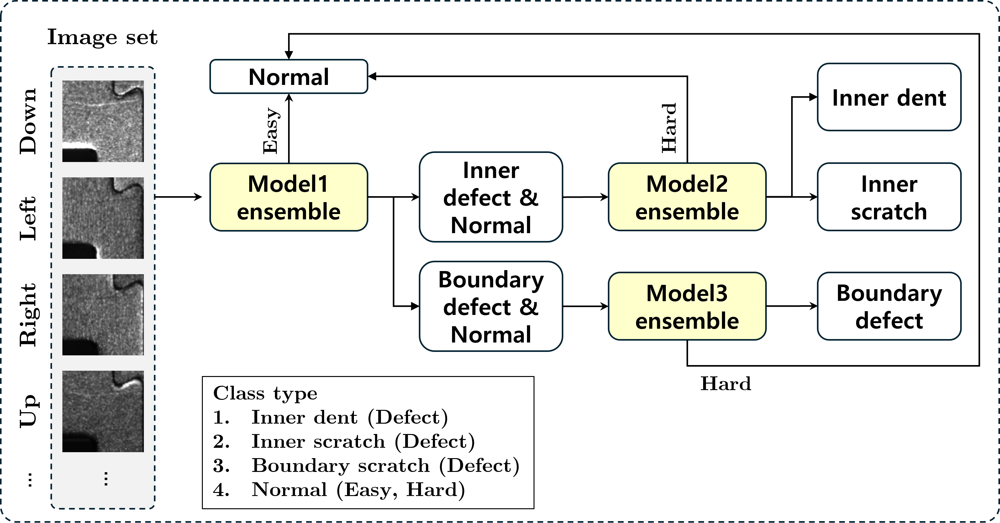

# 🔬 [2024] LGDisplay-DGU-Cooperation

## 📌 Project Overview

- **Title**: Development of a Multi-illumination Visual Inspection Algorithm  
- **Objective**: Defect Classification in Display Products  
- **Partner**: LG Display × Dongguk University (Industry-Academia Collaboration Project)
- **Duration**: March 2024 – February 2025
- **Meetings**: Monthly meetings, mid-term meeting in August 2024, final meeting in February 2025

## 🏆 Achievements

- ✅ **Defect Classification Accuracy**:  
  - 98.5% (192/195 images correctly classified on test set)

- ✅ **Normal Classification Accuracy**:  
  - 51.3% (157/306 images correctly classified on test set)

- ✅ **Deployment**:
  - The final algorithm developed in this project has been deployed in a real-world LG Display inspection system.

- ✅ **Paper in Progress**:  
  - Paper has been submitted and is under review (decision 2025.07.25).

- ✅ **Blog Post**: https://johyeongseob.tistory.com/57

---

## 🧩 Ensemble Architecture

The diagram below illustrates the overall ensemble strategy used in this project, where multiple model outputs are integrated to improve defect classification accuracy.

---

## 🧠 Code Description

This repository implements multiple ensemble models and deep learning backbones for defect classification under multi-illumination settings.

### 📁 `Ensemble/` Directory

- `model1_ensemble.py`  
  → Ensemble result script for Model 1  
- `model2_ensemble.py`  
  → Ensemble result script for Model 2  
- `model3_ensemble.py`  
  → Ensemble result script for Model 3  
- `model_ensemble.py`  
  → Final ensemble result integrating all models  
- `model_train.py`  
  → Training script for individual models  
- `model_evaluation.py`  
  → Evaluation script for each trained model  

### 📁 `models/` Directory

- `PretrainedSqueezeNet.py`  
  → SqueezeNet model pretrained on ImageNet-1k  
- `SENet.py`  
  → Implementation of the SENet (Squeeze-and-Excitation Network)

### 🧾 Other Core Scripts

- `Classifier.py`  
  → Contains the classification logic  
  - Uses `num_classes` parameter to switch model architecture

- `DataLoader.py`  
  → Prepares image batches for training and testing  
  - Uses `target` parameter to adjust for different model configurations

---

## 📂 Dataset

*This project uses a private dataset provided by LG Display and is not publicly available.*

---
